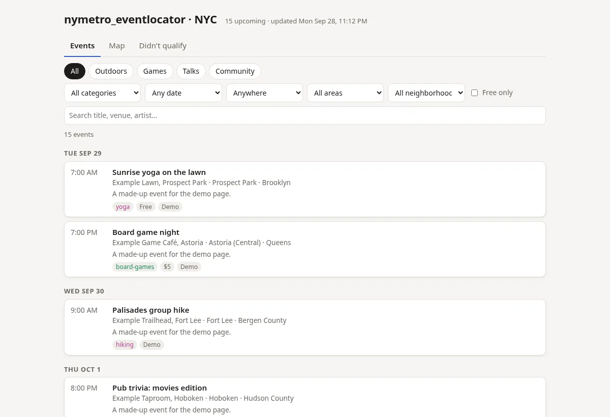
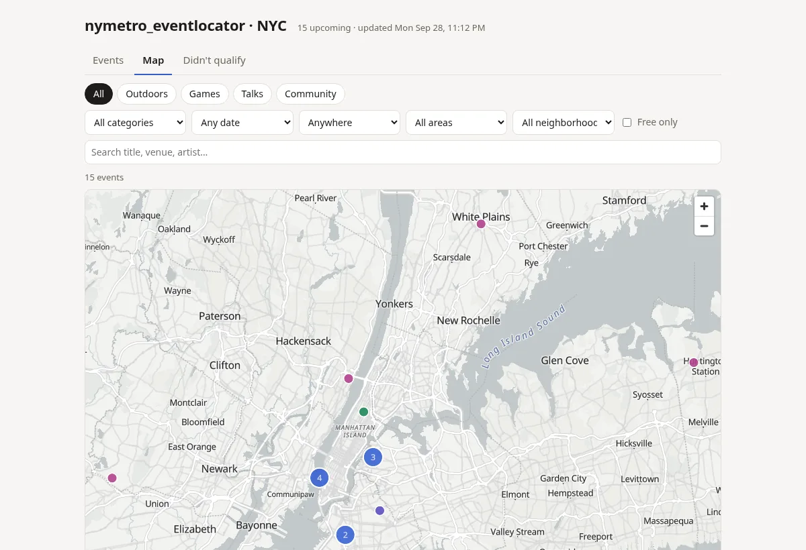

# nymetro_eventlocator

A personal event aggregator and locator. Each time you run it, it collects upcoming events from sources you choose
(Meetup and Luma group calendars, any iCal feed, Ticketmaster, …) and, if you set interests, sorts them
into sections you define. It then builds a local web page
with a list, a map and a "Didn't qualify" tab. Nothing is posted anywhere: everything stays on your machine.
With no interests set, it keeps every event from your sources in one **All events** section.
It runs once and exits; running it automatically every day is optional (see [step 6](#6-optional-run-it-on-a-schedule)).

| Events list | Map |
|---|---|
|  |  |

*Screenshots of `nymetro_eventlocator demo`: made-up events with the sections from
[examples/config.filtered.yaml](examples/config.filtered.yaml).*

The included example covers the **New York metro area**: the Census "New York–Newark–Jersey City"
metro area, meaning NYC, Long Island, Westchester/Rockland/Putnam and 12 northern and central New Jersey
counties. Everything is configured in one YAML file.

- **Polite by design:** every request goes through one gateway that checks robots.txt (including
  every redirect) and waits **at least 5 seconds** between requests to the same site. Neither can be
  switched off. Sites whose terms forbid automated access aren't used; see
  [docs/sources-compliance.md](docs/sources-compliance.md).
- **No secrets on disk in plaintext:** API keys live in your OS keychain
  (Windows Credential Manager, macOS Keychain, Linux Secret Service) or in systemd-creds encrypted files.

See [docs/ARCHITECTURE.md](docs/ARCHITECTURE.md) for how it works.

## Quick start
```sh
git clone https://github.com/brandonwan1/nymetro_eventlocator.git
cd nymetro_eventlocator
python3 -m venv .venv && . .venv/bin/activate       # Windows: py -m venv .venv  then  .venv\Scripts\Activate.ps1
pip install -r requirements.lock && pip install --no-deps .

nymetro_eventlocator demo --open                    # 1. a sample page right away: made-up events, nothing fetched
nymetro_eventlocator init                           # 2. create your config.yaml (NY metro area, keeps every event)
nymetro_eventlocator add https://www.meetup.com/<group-name>/   # 3. add each calendar you follow
nymetro_eventlocator run                            # 4. fetch events (one pass, then it exits)
nymetro_eventlocator render --open                  # 5. open your page
```
What you should see:
```text
$ nymetro_eventlocator demo --open
wrote output/demo.html: 15 sample events, 6 in the "Didn't qualify" tab (all made up, nothing fetched)
$ nymetro_eventlocator run
ical: 19 parsed
kept 19 (19 new), swept 0 stale; 26 requests, 0 robots-skipped
Rejected 0
```
Want sections (like the screenshots) instead of one list? Start from
[examples/config.filtered.yaml](examples/config.filtered.yaml); see [Customizing your interests](#customizing-your-interests).
The numbered steps below explain each part in more detail.

---

## Requirements
- **Python 3.12 or newer**
  - Windows: install from python.org or the Microsoft Store.
  - macOS: `brew install python`.
  - Linux: your package manager.
- **git**
- Works on **Windows 10/11, macOS 13+ and any modern Linux**.

## 1. Get the code
```sh
git clone https://github.com/brandonwan1/nymetro_eventlocator.git
cd nymetro_eventlocator
```

## 2. Install into a virtual environment
From inside the `nymetro_eventlocator` folder:

| OS | Commands |
|---|---|
| Linux / macOS | `python3 -m venv .venv` then `. .venv/bin/activate` |
| Windows (PowerShell) | `py -m venv .venv` then `.venv\Scripts\Activate.ps1` |

Then, on any OS:
```sh
pip install -r requirements.lock   # the exact, tested versions of every dependency
pip install --no-deps .            # the program itself
```
`requirements.lock` pins each library to the version the tests passed with, so your install matches everyone else's.
(`pip install .` alone also works, but takes whatever versions are newest that day.)

On Windows, if PowerShell refuses to run the activate script, run this once:
`Set-ExecutionPolicy -Scope CurrentUser RemoteSigned`.

**In every new terminal,** go to the folder and activate the environment again
(`. .venv/bin/activate` or `.venv\Scripts\Activate.ps1`) before running `nymetro_eventlocator`.
Your prompt shows `(.venv)` when it's active.
Or skip activation and call the program directly: `.venv/bin/nymetro_eventlocator …` (Linux/macOS) or `.venv\Scripts\nymetro_eventlocator …` (Windows).

**Updating later:**
```sh
git pull
pip install -r requirements.lock
pip install --no-deps .
```

## 3. Create your config and add calendars
```sh
nymetro_eventlocator init
```
`init` writes a starter `config.yaml` for the NY metro area, which is private (`.gitignore` keeps it out of git).
It starts with **no interests**, so every event from your calendars is kept, apart from online-only, out-of-area,
cancelled and duplicate ones. Start over with `init --force`; your previous config is kept as a dated backup.

**Add the groups and calendars you follow** by pasting their link:
```sh
nymetro_eventlocator add https://www.meetup.com/<group-name>/
nymetro_eventlocator add https://luma.com/<calendar>
```
It finds the calendar feed, checks robots.txt, and shows the next events and where they'd land
(`all/all` while you have no interests set).
It adds the feed only if you confirm, without touching the rest of your file.
Use `--category <interest>` for groups whose event titles are vague.

To sort events into sections by keyword, see [Customizing your interests](#customizing-your-interests). Check your edits with
`nymetro_eventlocator check-config`.

## 4. Add your secrets (only the ones you use)
Each command prompts with hidden input and stores the value in your OS's secret store.
Never put keys in `config.yaml`; it refers to them only by name, as `${TICKETMASTER_API_KEY}`.
```sh
nymetro_eventlocator secrets set TICKETMASTER_API_KEY    # free key from developer.ticketmaster.com
nymetro_eventlocator secrets set EVENTBRITE_TOKEN        # only if you enable the Eventbrite source
nymetro_eventlocator secrets list                        # where each secret comes from; never prints values
```
Ticketmaster is `enabled: true` in `config.yaml` by default, so setting the key is the only step needed —
you don't also need to flip anything on. Without a key, it logs an error each run and contributes no events;
set `enabled: false` under `sources: ticketmaster:` if you don't want to use it. Eventbrite ships `enabled: false`
since it also needs `organizers:`/`venues:` ids, not just a token.
Where secrets are stored:

| OS | Default store (`secrets_backend: auto`) |
|---|---|
| Windows | Windows Credential Manager |
| macOS | Keychain. Allow "Always" the first time macOS asks. |
| Linux with systemd ≥ 256 | `systemd-creds` encrypted files in `~/.config/nymetro_eventlocator/credentials/` |
| Linux desktop, other | Secret Service (GNOME Keyring / KWallet) |
| Docker / CI | environment variables (`secrets_backend: env`), shown as plaintext by `secrets list` |

You can force a store with `secrets_backend:` in `config.yaml` or the `NYMETRO_EVENTLOCATOR_SECRETS_BACKEND` environment variable.

## 5. Run
```sh
nymetro_eventlocator run
nymetro_eventlocator render --open      # opens output/index.html in your browser
```
All commands are listed in the [Command reference](#command-reference).

## 6. (Optional) Run it on a schedule
`run` does one pass and exits; nothing keeps running in the background. If you want fresh events every day
without typing the command, hand it to your operating system's scheduler. This is separate from the program
itself, and you can remove it at any time.
```sh
nymetro_eventlocator schedule install --time 09:00 --print   # show exactly what will be installed
nymetro_eventlocator schedule install --time 09:00
nymetro_eventlocator schedule status
nymetro_eventlocator schedule remove
```

| OS | What gets installed |
|---|---|
| Linux | systemd **user** timer (`~/.config/systemd/user/nymetro_eventlocator.timer`). If the machine was off at 9:00, it runs when it's back. For runs while you're logged out, enable lingering: `loginctl enable-linger $USER` |
| macOS | launchd agent `~/Library/LaunchAgents/org.nymetro_eventlocator.daily.plist`. It runs while you're logged in. |
| Windows | Task Scheduler task `nymetro_eventlocator`. It runs as you, while you're logged in. |

## Command reference
Run these from the `nymetro_eventlocator` folder with the environment activated. Add `--help` to any command for details.

**Main commands**

| Command | What it does |
|---|---|
| `nymetro_eventlocator run` | One full pass, then exit: fetch every enabled source, filter, store, and rebuild the web page |
| `nymetro_eventlocator render --open` | Rebuild the web page from stored events and open it in your browser (no fetching) |
| `nymetro_eventlocator rejected` | What didn't qualify, and why (e.g. no matching interest, outside the area, duplicate) |
| `nymetro_eventlocator rejected --reason no_category --since 7d` | Only one reason, only recent. Handy for finding keywords to add |
| `nymetro_eventlocator rejected --summary` | A one-line count per reason |

**Setting up and checking**

| Command | What it does |
|---|---|
| `nymetro_eventlocator demo --open` | Build a sample page from made-up events and open it: no config, keys or network needed |
| `nymetro_eventlocator init` | Create a starter `config.yaml` (`--force` replaces an existing one, keeping a backup) |
| `nymetro_eventlocator add <link>` | Add a Meetup group, Luma calendar or `.ics` link: preview, then add on confirmation (`--category`, `--name`, `--yes`) |
| `nymetro_eventlocator check-config` | Validate `config.yaml` and say what's wrong, if anything |
| `nymetro_eventlocator scrape --source ical` | Fetch just one source and list each event it kept or rejected. Sources: `ical`, `ticketmaster`, `eventbrite`, `jsonld`, `confstech`, `manual` |
| `nymetro_eventlocator robots <url>` | Whether a URL may be fetched under the site's robots.txt, and the delay that applies. Check this before adding a site |

**Secrets** (API keys; stored in your OS keychain or encrypted files, never in `config.yaml`)

| Command | What it does |
|---|---|
| `nymetro_eventlocator secrets list` | Each secret your config uses, and whether it's stored, in plaintext `.env`, or missing. Never shows values |
| `nymetro_eventlocator secrets set TICKETMASTER_API_KEY` | Store a secret; you're prompted with hidden input |
| `nymetro_eventlocator secrets import-env` | Move secrets from a plaintext `.env` into secure storage, then remove them from `.env` |
| `nymetro_eventlocator secrets delete NAME` | Delete a stored secret |

**Optional daily schedule**

| Command | What it does |
|---|---|
| `nymetro_eventlocator schedule install --time 09:00 --print` | Show what would be installed, without changing anything |
| `nymetro_eventlocator schedule install --time 09:00` | Run `nymetro_eventlocator run` every day at that time (systemd / launchd / Task Scheduler) |
| `nymetro_eventlocator schedule status` | What the scheduler says about it |
| `nymetro_eventlocator schedule remove` | Stop the daily run |

**Options for any command**

| Option | What it does |
|---|---|
| `-c path/to/config.yaml` | Use a different config file (default: `config.yaml` in the current folder) |
| `-v` | Verbose logging |

## Customizing your interests
A complete, commented example with filtering is in [examples/config.filtered.yaml](examples/config.filtered.yaml)
(the same sections as `nymetro_eventlocator demo`).
Everything below is in `config.yaml`; no code changes needed. After any edit, run `nymetro_eventlocator check-config`:
it catches unknown sections and bad patterns.

**No interests = everything.** With no `categories:` at all, every event from your enabled sources is kept in one
built-in **All events** section. The safety filters still apply: outside the region, online-only, `exclude_keywords`,
cancelled/postponed titles and duplicates are dropped. As soon as you add your first category, filtering is on:
events that match no interest are set aside (see `rejected --reason no_category`).

### 1. Sections (`groups:`)
A group is a section of the web page, shown as a filter.
```yaml
groups:
  outdoors: { label: Outdoors }
  tech:     { label: Tech }
```

### 2. Interests (`categories:`)
Each category is a list of keywords, and belongs to one section. Matching rules:
- An event goes to the **first** category (top to bottom) whose keywords appear in its title, or failing that, in its description.
- Keywords are whole words or phrases, case-insensitive, and "stand-up" matches "stand up".
- Put specific interests **above** general ones.
```yaml
categories:
  - id: yoga
    group: outdoors
    keywords: [yoga, vinyasa, acro yoga, sound bath]
  - id: board-games
    group: tech
    keywords: [board game, board games, game night, catan, dungeons and dragons]
  - id: hangouts           # a catch-all, tried only after everything else
    group: outdoors
    fallback: true
    keywords: [meetup, social, mixer]
```
Other options:
- **`patterns:`** for regular expressions, e.g. `'\bexamplecon\w*'` for names written as one word ("ExampleConNYC").
- **`match_venue: false`** to ignore venue names. Use it when a keyword could appear in a place name, e.g. "park" in "Park Slope Library".
- **`exclude_keywords:`** (top level) drops anything mentioning those words: `[for kids, toddler]`.

### 3. Where events come from (`sources:`)
Add the groups and calendars you care about as **calendar feeds**. Each feed can name a `category` as a hint,
which is used only when no keyword matches (useful when titles are vague, like "Tuesday meetup").
```yaml
sources:
  ical:
    enabled: true
    feeds:
      - { name: my-yoga-group,  url: "https://www.meetup.com/<group-name>/events/ical/", category: yoga }
      - { name: my-luma-calendar,  url: "https://api.lu.ma/ics/get?entity=calendar&id=cal-XXXXXXXX" }
```
Finding feeds:
- **Meetup:** every public group has one at `https://www.meetup.com/<group-name>/events/ical/`, where `<group-name>` is the part of the group's URL after `meetup.com/`. Private groups return an error; don't try to get around that.
- **Luma:** on a calendar's page, choose **Add iCal Subscription** and copy the link.
- **Any other site:** look for "Subscribe", "iCal", "Add to calendar" or ".ics" links. First check with `nymetro_eventlocator robots <url>` that you're allowed to fetch it.
- **Ticketmaster:** on by default once you set the API key (see [step 4](#4-add-your-secrets-only-the-ones-you-use)); adjust the `searches` circles for your area. It defaults to `classification: music` — set `classification:` to `sports`, `arts & theatre`, `family`, etc. to change what it returns.

Try a change on one source without a full run:
```sh
nymetro_eventlocator scrape --source ical            # what each feed returns, and where each event lands
nymetro_eventlocator rejected --reason no_category   # events that matched no interest: add keywords, or ignore them
```

## Responsible use (please read)
- **Use your own API keys** and follow each provider's terms. Ticketmaster and Eventbrite data may only be kept for future events; nymetro_eventlocator deletes past ones automatically.
- **Don't weaken the politeness rules.** The 5-second minimum and robots.txt checks are enforced in code on purpose.
- **Before adding a new website,** read its `robots.txt` and terms of service, and prefer, in order: an **RSS/iCal feed**, then an **official API**, then **plain HTML** (a headless browser only as a last resort). Record your findings in `docs/sources-compliance.md`.
- **Don't publish other people's data.** Saved pages used as test fixtures must be synthetic.

## Adapting it to another city
1. **Region:** in `config.yaml`, set `region.timezone`, `region.center` and `region.bbox`.
2. **Boundaries:** replace the files under `region.areas` / `region.neighborhoods` with GeoJSON for your city, and put them in `nymetro_eventlocator/geo/data/`.
3. **Sources:** add local calendar feeds with `add <link>`. Ticketmaster works anywhere; change its `searches` circles.
4. **Geocoding:** NYC GeoSearch (for addresses) only covers NYC. Elsewhere, rely on sources that include coordinates, or on the US Census geocoder (US only).

**Optional: events outside your area.**
- Two more built-in sources are available: `confstech` (open conference data by topic) and `manual` (hand-entered events).
- To keep events from anywhere in a section, add `scope: global` to that group. Events outside your region are then tagged NY metro / US / international instead of being rejected.

## Development
```sh
pip install -r requirements-dev.lock
pip install --no-deps -e .
pytest              # add --cov for a coverage report
ruff check .        # lint (rules in pyproject.toml); `ruff check --fix .` applies safe fixes
```
The tests never touch the network or your real secrets. CI runs them on Linux, macOS and Windows,
installing from the same lock file.

**Changing dependencies:** edit `pyproject.toml`, then regenerate both lock files and re-test:
```sh
pip install uv                      # once; only needed to regenerate the locks
python scripts/lock.py              # re-pin (use --upgrade to move everything to the newest versions)
pip install -r requirements-dev.lock && pytest
```
Commit `pyproject.toml` and both `.lock` files together. CI fails if the lock files are out of date.

Want to help, or add a new event source? Read [CONTRIBUTING.md](CONTRIBUTING.md) first.

## License
MIT; see [LICENSE](LICENSE). Third-party data and services: see [NOTICE.md](NOTICE.md).
